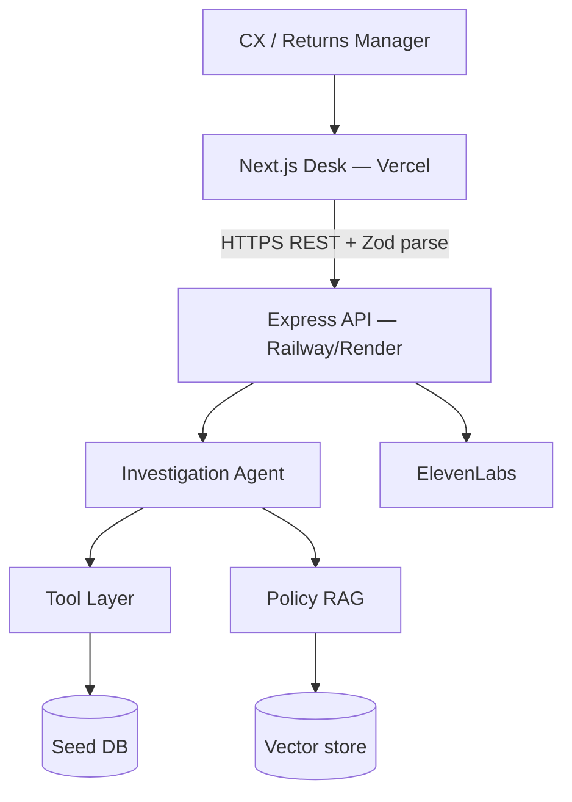
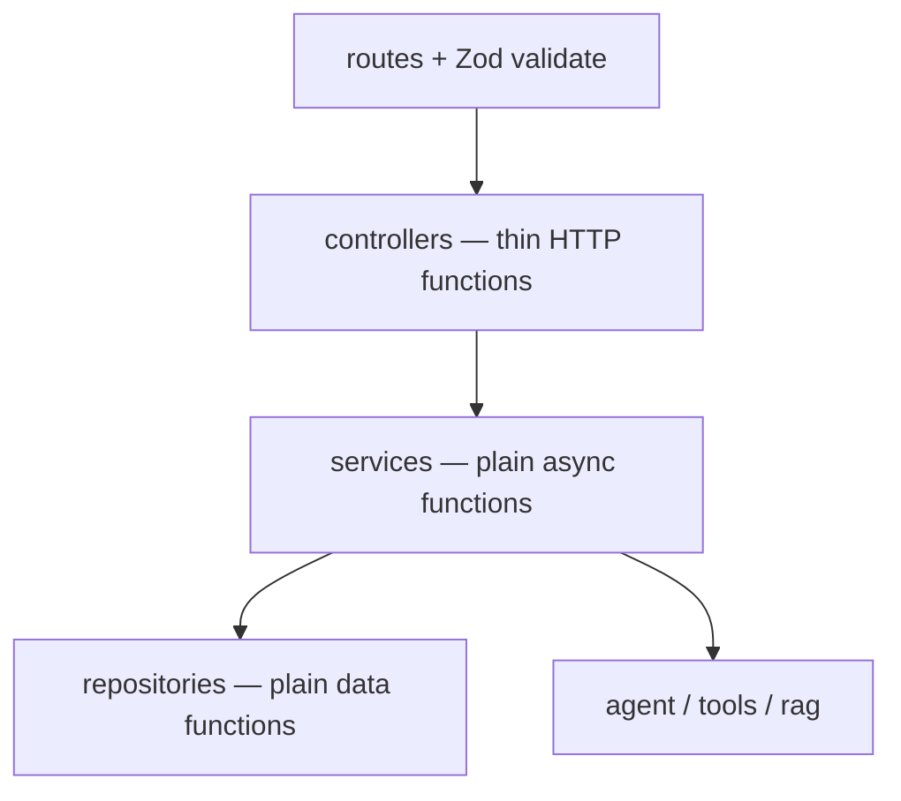
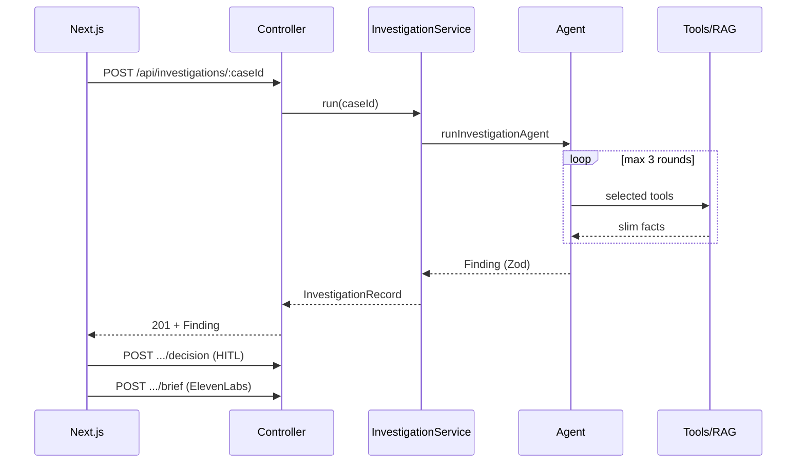

# Architecture — Ecommerce Dispute Investigator

**Positioning:** We don’t automate refunds. We automate the investigation before the refund.  
**Principle:** Fake the commerce stack. Real the investigation loop.

**Deploy:** `frontend/` (Next.js 16 → Vercel) and `backend/` (Express → Railway/Render) are **separate** projects.

---

## 1. System context

---

## Backend layout (routes → controllers → services → repositories)

| Layer | Responsibility |
|---|---|
| `routes/` | Path + Zod `validate` |
| `controllers/` | Call service functions; send JSON |
| `services/` | Business logic as **functions** (no classes) |
| `repositories/` | Data access as **functions** |
| `schemas/` | Zod contracts |

---

## 3. Investigation sequence

---

## 4. Frontend

- App Router desk: queue + `/cases/[id]`
- `lib/api.ts` validates responses with **Zod** before UI use
- Schemas mirrored under `frontend/src/schemas/` (keep in sync with backend)

---

## 5. Demo cases

| ID | Expected |
|---|---|
| 1042 | HOLD |
| 1087 | APPROVE |
| 1112 | REQUEST_INFO |

---

## Out of scope

LangGraph · CRAG · Vision · monorepo workspaces · real Shopify/GPS · full RBAC
